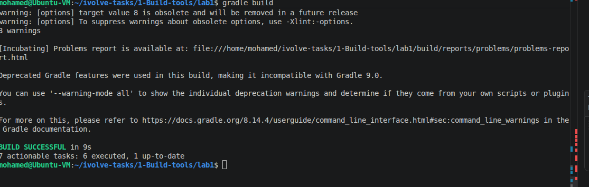
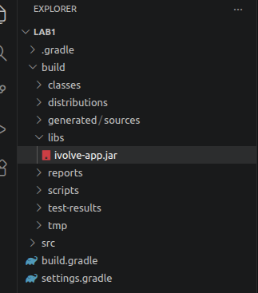

# Lab 1: Building and Packaging Java Applications with Gradle

## 📝 Overview
This lab demonstrates the fundamental DevOps workflow of using **Gradle** to manage, test, and package a Java application. The objective was to successfully compile the source code, run unit tests, and generate a deployable JAR artifact.

## 🛠️ Environment Setup
* **Operating System:** Ubuntu (Linux)
* **Build Tool:** Gradle (Version 8.x)
* **Language:** Java
* **Project Repository:** [build1](https://github.com/Ibrahim-Adel15/build1.git)

## 🚀 Implementation Details
1. **Repository Cloning:** Cloned the project from the provided GitHub source.
2. **Build Execution:** Utilized the `gradle build` command to process the application.
3. **Outcome:** Successfully created the application artifact located at `build/libs/ivolve-app.jar`.

## 🧪 Results & Verification
### How to Run
To execute the packaged application, use the following commands:
```bash
cd build/libs
java -jar ivolve-app.jar
```
### Lab Documentation Screenshots



**Generated JAR File:**

