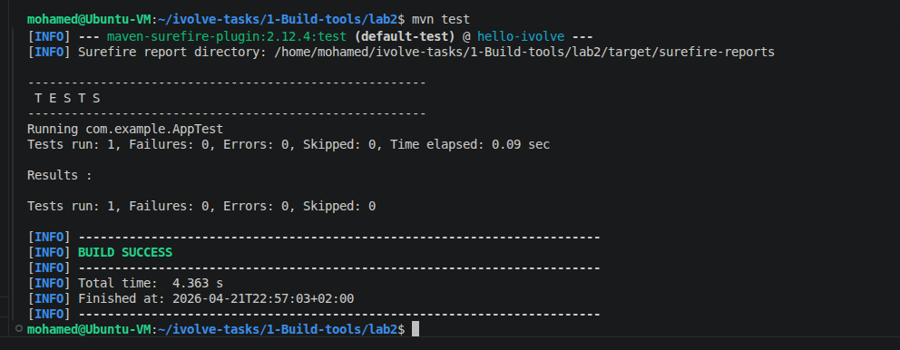
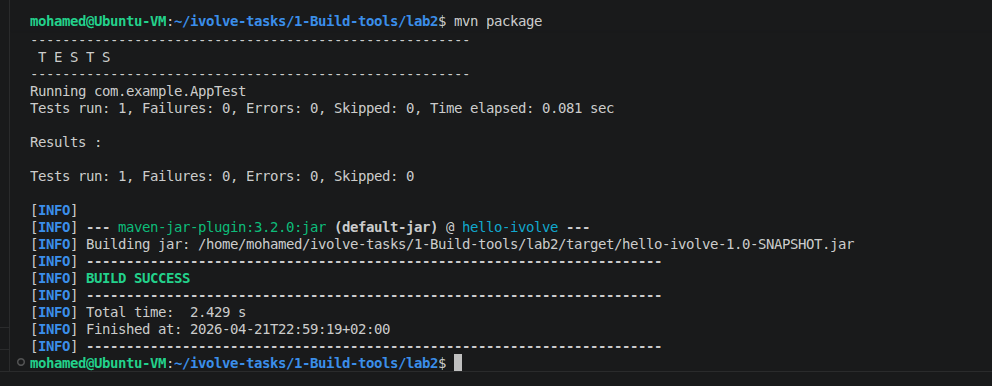
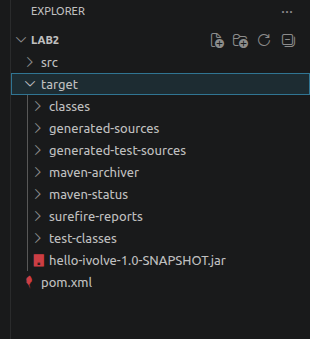
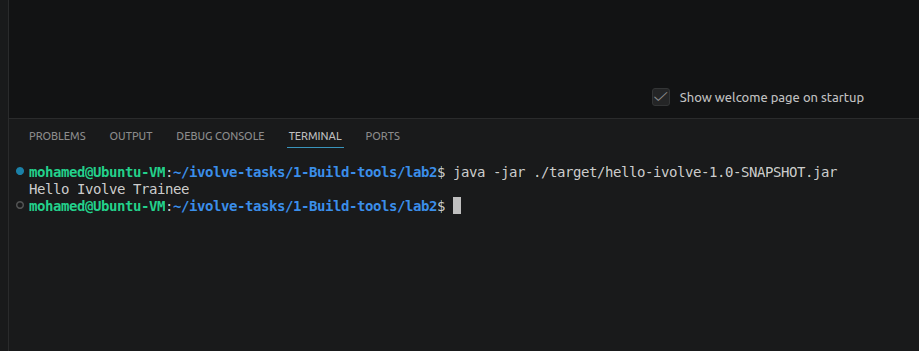

# Lab 2: Building and Packaging Java Applications with Maven

## 📝 Overview
This lab covers the use of **Apache Maven** for build automation. The focus is on project lifecycle management, including running unit tests and packaging a Java application into a `.jar` artifact.

## 🛠️ Environment Setup
* **Operating System:** Ubuntu (Linux)
* **Build Tool:** Apache Maven
* **Language:** Java
* **Project Repository:** [build2](https://github.com/Ibrahim-Adel15/build2.git)

## 🚀 Implementation Details
1. **Repository Cloning:** Cloned the project from the provided GitHub source.
2. **Testing:** Executed `mvn test` to verify the application logic.
3. **Packaging:** Ran `mvn package` to compile the source and generate the executable JAR.
    * *Artifact generated at:* `target/hello-ivolve-1.0-SNAPSHOT.jar`

## 🧪 Results & Verification
### How to Run
To execute the packaged application, run:
```bash
java -jar ./target/hello-ivolve-1.0-SNAPSHOT.jar
```
### Lab Documentation Screenshots
***1. Running Unit Tests:***


***2. Maven Package Build:***



***3. Generated Artifact in Target Folder:***



***4. Running the Application:***

