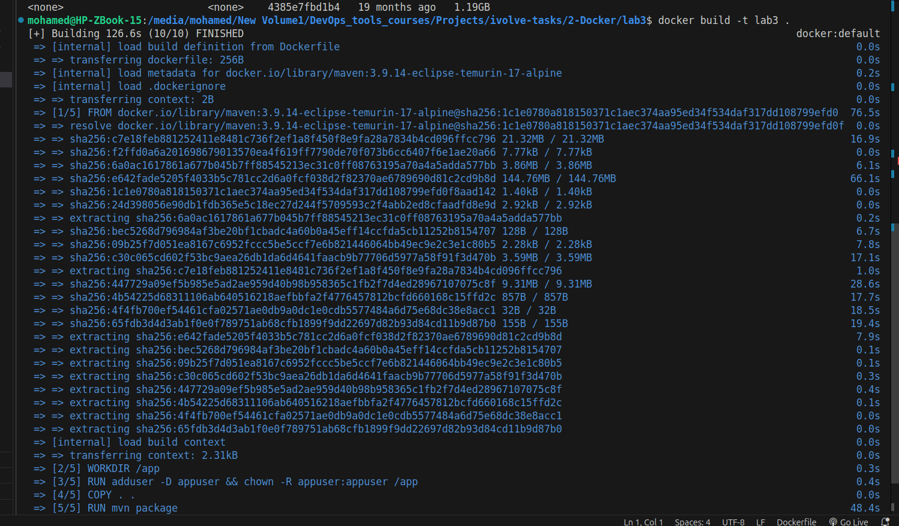
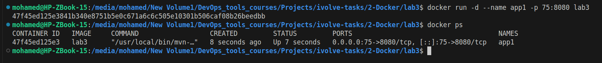
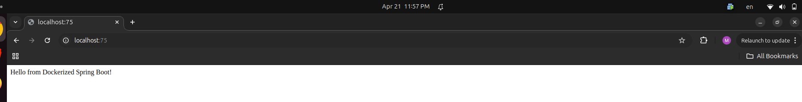
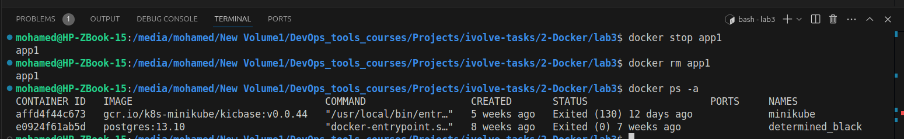

# Lab 3: Run Java Spring Boot App in a Container

## 📝 Overview
This lab demonstrates how to containerize a Java Spring Boot application using Docker. This involves creating a `Dockerfile` that packages the application and exposes it on a network port.

## 🛠️ Environment Setup
* **Base Image:** `maven:3.8.5-openjdk-17`
* **Application:** Spring Boot (Java 17)
* **Project Repository:** [Docker-1](https://github.com/Ibrahim-Adel15/Docker-1.git)

## 🚀 Implementation Details
1. **Dockerfile Configuration:** Defined steps to set the working directory, copy source files, and execute the Maven build.
2. **Build Process:**
   ```bash
   docker build -t lab3 .
    ```
3. **Run Container:**
    ```bash
    docker run -d --name app1 -p 75:8080 lab3
    ```
### Lab Documentation Screenshots
***1. Build Docker Image:***



***2. Running Docker Container:***



***3. Test The App:***



***4. Stop And Delete The Container:***

