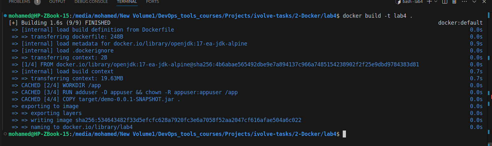
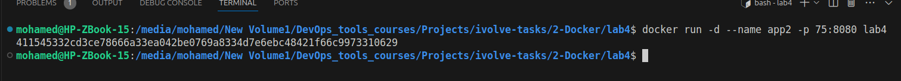
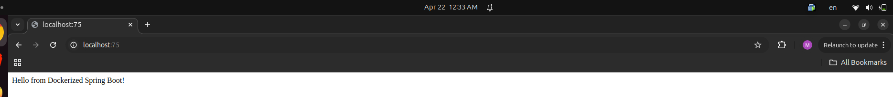
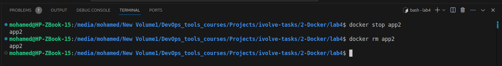

# Lab 4: Optimized Java Spring Boot Containerization

## 📝 Overview
This lab demonstrates the best practice of building a Java application locally and packaging the resulting artifact into a lightweight, optimized Docker image. This approach minimizes the image size by avoiding the inclusion of build tools in the final runtime container.

## 🛠️ Environment Setup
* **Base Image:** `openjdk:17-jdk-slim`
* **Build Tool:** Apache Maven
* **Application:** Spring Boot (Java 17)
* **Project Repository:** [Docker-1](https://github.com/Ibrahim-Adel15/Docker-1.git)

## 🚀 Implementation Details
1. **Local Build:** Compiled the source code using `mvn package`.
2. **Dockerfile Creation:** * Used `openjdk:17-jdk-slim` for a smaller footprint.
   * Defined `/app` as the working directory.
   * Used `COPY` to import the pre-built `target/demo-0.0.1-SNAPSHOT.jar`.
3. **Containerization:** Built the image with:
   `docker build -t lab4 .`

## 🧪 Results & Verification

### 1. Image Build Process


### 2. Running the Container


### 3. Application Verification


### 4. Cleanup Operations


### Execution Commands
```bash
# Build the image
docker build -t lab4 .

# Run the container
docker run -d -p 8080:8080 --name app2 lab4

# Stop and remove the container
docker stop app2
docker rm app2