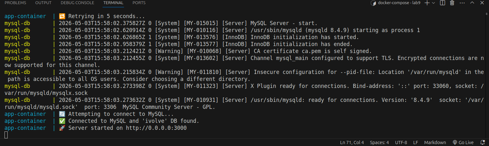
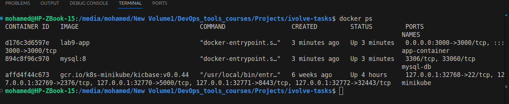
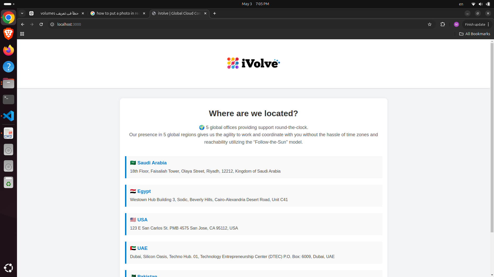
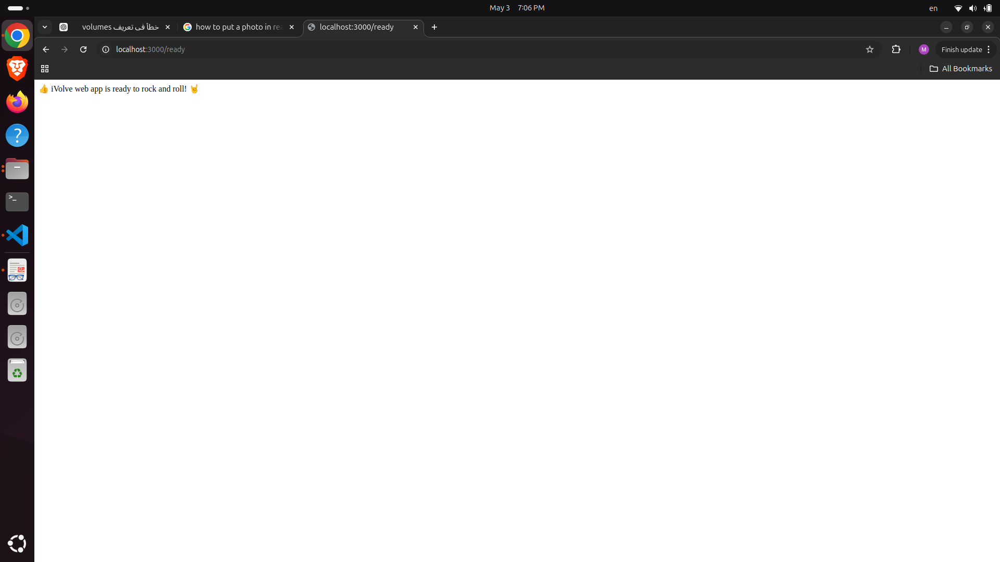

# Lab 9: Containerized Node.js and MySQL Stack Using Docker Compose

## Overview
This project demonstrates how to containerize a Node.js application with a MySQL database using Docker Compose.

The application requires a MySQL database named **ivolve** to run successfully.

---

## Repository
Clone the application source code:

```bash
git clone https://github.com/Ibrahim-Adel15/kubernets-app.git
```
## Services
### 1. App Service
* Built from local Dockerfile
* Runs Node.js application
* Exposes port 3000
* Uses environment variables for database connection
### 2. Database Service (MySQL)
* Uses MySQL 8 image
* Creates required database automatically
* Persists data using Docker volume

## Docker Compose Configuration
```yml
version: "3.8"

volumes:
  db_mysql:

services:
  app:
    build: .
    container_name: app-container
    environment:
      DB_HOST: db
      DB_USER: appuser
      DB_PASSWORD: complexPassword
    ports:
      - "3000:3000"
    depends_on:
      - db

  db:
    image: mysql:8
    container_name: mysql-db
    volumes:
      - db_mysql:/var/lib/mysql
    environment:
      MYSQL_ROOT_PASSWORD: pass123
      MYSQL_DATABASE: ivolve
      MYSQL_USER: appuser
      MYSQL_PASSWORD: complexPassword
```
## Environment Variables

### App Service
* DB_HOST=db
* DB_USER=appuser
* DB_PASSWORD=complexPassword
### MySQL Service
* MYSQL_ROOT_PASSWORD=pass123
* MYSQL_DATABASE=ivolve
* MYSQL_USER=appuser
* MYSQL_PASSWORD=complexPassword

## Run the Application
```Bash
docker compose up -d
```


## Verify the Application
### 1. Check Running Containers
```bash
docker ps
```


### 2. Access Application
Open in browser:
```
http://localhost:3000
```




## Volume Persistence
* MySQL data is stored in `db_mysql` volume
* Data will persist even if containers are removed

## Stop the Application
```bash
docker compose down
```
# Push Docker Image to Docker Hub
## 1. Build Image
```bash
docker build -t your-dockerhub-username/node-app .
```
## 2. Login to Docker Hub
```bash
docker login
```
## 3. Push Image
```bash
docker push your-dockerhub-username/node-app
```
