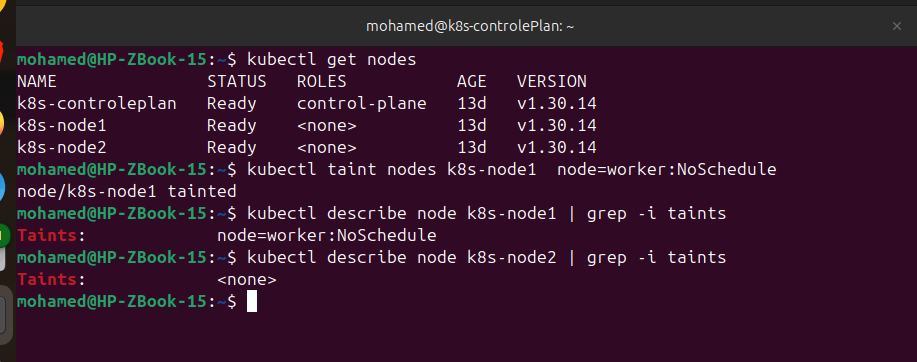

# Lab 10: Node Isolation Using Taints in Kubernetes

This repository documents the process for isolating cluster resources using Kubernetes node taints. Specifically, it covers how to apply the `NoSchedule` effect to restrict pod placement, how to verify the configuration across the cluster, and how to safely revert the changes.

## Overview

Taints allow a node to repel a set of pods. By applying a `NoSchedule` taint, the Kubernetes scheduler will ignore this node for any new pod deployments unless the pod explicitly contains a matching **toleration** in its configuration. 

*Note: Existing pods running on the node prior to applying the taint are not evicted.*

---

## 🚀 Step-by-Step Guide

### 1. Apply the Taint
To isolate a specific node, apply the `NoSchedule` taint using the following syntax:

```bash
kubectl taint nodes <node-name> <key>=<value>:NoSchedule
```

**Example:**
To dedicate a node named `node1` to a specific engineering group:
```bash
kubectl taint nodes node1 dedicated=team-alpha:NoSchedule
```

### 2. Verify the Taint
Verify that the taint has been successfully applied to your cluster nodes using any of the validation commands below.

#### Method A: Filtered Node Description (Recommended)
Inspect all nodes simultaneously while filtering out clutter to see only node names and their assigned taints:
```bash
kubectl describe node k8s-node1 | grep -i taints
```



