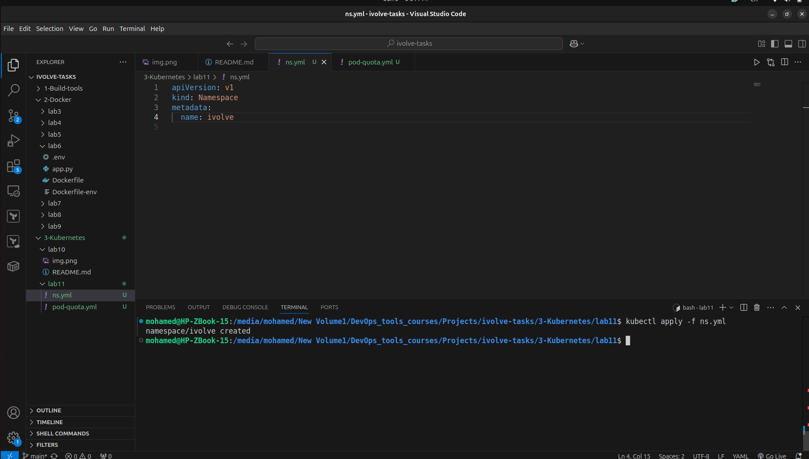
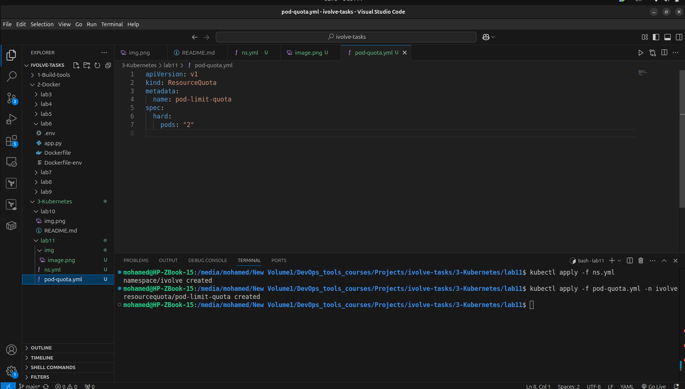

# Lab 11: Namespace Management and Resource Quota Enforcement

This repository contains the configuration assets required to enforce workload density constraints within a target Kubernetes namespace. It uses a declarative `ResourceQuota` object to restrict the namespace to a maximum of two concurrent pods.

## Purpose

Enforcing hard limits on pod counts helps engineer reliable multi-tenant environments. This configuration prevents resource starvation, curbs unexpected cloud billing spikes, and isolates test workloads from noisy-neighbor scenarios.

## File Structure

```text
├── ns.yaml               # Defines the target isolation boundary
└── pod-quota.yaml        # Configures the 2-pod maximum hard limit
```

## Quick Start

### 1. Provision the Infrastructure
Create the target isolation boundary where the restriction will live:
```bash
kubectl apply -f ns.yaml
```

### 2. Enforce the Constraint
Apply the policy rule directly to your newly created namespace:
```bash
kubectl apply -f pod-quota.yaml -n ivolve
```


## Manifest Reference

### `namespace.yaml`
```yaml
apiVersion: v1
kind: Namespace
metadata:
  name: my-namespace
```

### `pod-quota.yaml`
```yaml
apiVersion: v1
kind: ResourceQuota
metadata:
  name: pod-limit-quota
spec:
  hard:
    pods: "2"
```
